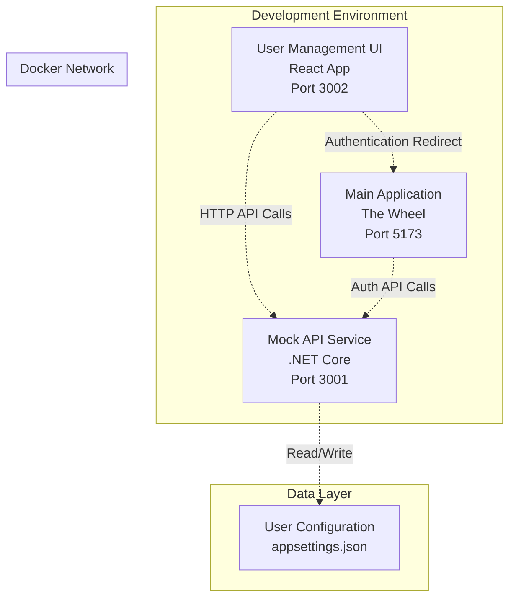

# Design Document

## Overview

The Mock User Management UI is a React-based web application that provides a user-friendly interface for managing test users in the mock API service environment. It will be containerized as a separate service that communicates with the existing mock API service to perform user management operations and facilitate quick authentication testing.

The UI will serve as a developer/tester tool that runs alongside the mock API service, providing an intuitive way to create, edit, delete, and impersonate test users without requiring manual configuration file editing or API calls.

## Architecture

### System Architecture



### Container Architecture

The solution will extend the existing docker-compose setup with a new service:

- **mock-user-ui**: React application serving the user management interface
- **mock-api**: Existing .NET Core API service (enhanced with user management endpoints)
- **Shared Network**: Both containers on the same Docker network for communication

### Technology Stack

**Frontend (User Management UI):**
- React 18.3.1 with TypeScript
- Vite for build tooling and dev server
- SCSS for styling (consistent with main application)
- Axios for HTTP client communication
- React Hook Form for form management
- React Router for navigation (if needed)

**Backend (Enhanced Mock API):**
- Existing .NET 8 Web API
- New UserManagementController for CRUD operations
- Enhanced AuthController for impersonation functionality
- JSON file-based user storage (appsettings.json)

## Components and Interfaces

### Frontend Components

#### Core Components

1. **UserManagementApp** - Root application component
   - Manages global state and routing
   - Handles error boundaries and loading states

2. **UserList** - Displays list of all test users
   - Tabular display with user information
   - Action buttons for edit, delete, login-as operations
   - Search and filter capabilities

3. **UserForm** - Form for creating/editing users
   - Controlled form inputs with validation
   - Support for create and edit modes
   - Real-time validation feedback

4. **UserCard** - Individual user display component
   - Shows user details in card format
   - Quick action buttons
   - Status indicators

5. **LoginAsButton** - Specialized button for user impersonation
   - Handles authentication flow
   - Redirects to main application
   - Error handling for failed authentication

#### Utility Components

1. **LoadingSpinner** - Reusable loading indicator
2. **ErrorMessage** - Error display component
3. **ConfirmDialog** - Confirmation modal for destructive actions
4. **Toast** - Success/error notifications

### Backend API Endpoints

#### New User Management Endpoints

```typescript
// User Management API Interface
interface UserManagementAPI {
  // Get all users
  GET /v1/users
  Response: MockUser[]

  // Get user by ID
  GET /v1/users/{id}
  Response: MockUser

  // Create new user
  POST /v1/users
  Body: CreateUserRequest
  Response: MockUser

  // Update existing user
  PUT /v1/users/{id}
  Body: UpdateUserRequest
  Response: MockUser

  // Delete user
  DELETE /v1/users/{id}
  Response: 204 No Content

  // Impersonate user (generate auth token)
  POST /v1/users/{id}/impersonate
  Response: LoginResponse
}
```

#### Enhanced Authentication Endpoints

```typescript
// Enhanced Auth API
interface AuthAPI {
  // Existing endpoints remain unchanged
  POST /v1/auth/login
  POST /v1/auth/register
  POST /v1/auth/refresh

  // New impersonation endpoint
  POST /v1/auth/impersonate
  Body: { userId: string }
  Response: LoginResponse
}
```

### Data Models

#### Frontend Models

```typescript
interface User {
  uid: string;
  email: string;
  displayName: string;
  createdAt: string;
  emailVerified: boolean;
}

interface CreateUserRequest {
  email: string;
  password: string;
  displayName: string;
}

interface UpdateUserRequest {
  email?: string;
  password?: string;
  displayName?: string;
}

interface UserManagementState {
  users: User[];
  isLoading: boolean;
  error: string | null;
  selectedUser: User | null;
}
```

#### Backend Models (Enhanced)

```csharp
// Enhanced MockUser model
public class MockUser
{
    public string Uid { get; set; } = string.Empty;
    public string Email { get; set; } = string.Empty;
    public string DisplayName { get; set; } = string.Empty;
    public string PasswordHash { get; set; } = string.Empty;
    public DateTime CreatedAt { get; set; }
    public bool EmailVerified { get; set; } = true;
    public bool IsTestUser { get; set; } = true; // New field to identify test users
}

// New request models
public class CreateUserRequest
{
    [Required, EmailAddress]
    public string Email { get; set; } = string.Empty;
    
    [Required, MinLength(6)]
    public string Password { get; set; } = string.Empty;
    
    [Required]
    public string DisplayName { get; set; } = string.Empty;
}

public class UpdateUserRequest
{
    [EmailAddress]
    public string? Email { get; set; }
    
    [MinLength(6)]
    public string? Password { get; set; }
    
    public string? DisplayName { get; set; }
}

public class ImpersonateRequest
{
    [Required]
    public string UserId { get; set; } = string.Empty;
}
```

## Error Handling

### Frontend Error Handling

1. **Network Errors**
   - Connection timeout handling
   - Retry mechanisms for failed requests
   - Offline state detection and messaging

2. **Validation Errors**
   - Real-time form validation
   - Server-side validation error display
   - Field-specific error messages

3. **Authentication Errors**
   - Failed impersonation handling
   - Token expiration management
   - Redirect error recovery

4. **User Experience Errors**
   - Loading state management
   - Graceful degradation
   - User-friendly error messages

### Backend Error Handling

1. **Validation Errors**
   - Model validation with detailed error responses
   - Duplicate email prevention
   - Required field validation

2. **Data Persistence Errors**
   - File system access error handling
   - JSON serialization error recovery
   - Backup and recovery mechanisms

3. **Authentication Errors**
   - Invalid user ID handling
   - Token generation failure recovery
   - Security validation

### Error Response Format

```typescript
interface ErrorResponse {
  error: string;           // Error code (e.g., "VALIDATION_ERROR")
  message: string;         // Human-readable message
  details?: any;          // Additional error details
  timestamp?: string;     // Error timestamp
}
```

## Testing Strategy

### Frontend Testing

1. **Unit Tests**
   - Component rendering tests
   - Form validation logic
   - State management functions
   - API service methods

2. **Integration Tests**
   - User workflow testing
   - API integration testing
   - Error scenario testing
   - Authentication flow testing

3. **E2E Tests**
   - Complete user management workflows
   - Cross-application authentication testing
   - Error recovery scenarios

### Backend Testing

1. **Unit Tests**
   - Controller action tests
   - Service method tests
   - Model validation tests
   - Authentication logic tests

2. **Integration Tests**
   - API endpoint testing
   - Database operation testing
   - Authentication flow testing
   - Error handling validation

3. **API Tests**
   - HTTP endpoint validation
   - Request/response format testing
   - Error response validation
   - Security testing

### Test Data Management

1. **Test User Fixtures**
   - Predefined test users for consistent testing
   - Isolated test data sets
   - Cleanup mechanisms

2. **Mock Data Services**
   - Configurable mock responses
   - Error simulation capabilities
   - Performance testing data

## Deployment and Configuration

### Docker Configuration

#### New docker-compose Service

```yaml
services:
  mock-user-ui:
    build:
      context: ./mock-user-ui
      dockerfile: Dockerfile
    ports:
      - "3002:3002"
    environment:
      - VITE_API_BASE_URL=http://mock-api:3001
      - VITE_MAIN_APP_URL=http://localhost:51235
    depends_on:
      - mock-api
    networks:
      - mock-api-network
    container_name: mock-user-ui
```

#### Enhanced Mock API Configuration

```yaml
services:
  mock-api:
    # Existing configuration
    environment:
      # Existing variables
      - CORS_ORIGINS=http://localhost:51235,http://localhost:3000,http://localhost:3002
      # New user management configuration
      - USER_MANAGEMENT_ENABLED=true
      - TEST_USER_PREFIX=test_
```

### Environment Variables

#### User Management UI

- `VITE_API_BASE_URL`: Mock API service URL
- `VITE_MAIN_APP_URL`: Main application URL for redirects
- `VITE_APP_TITLE`: Application title (default: "User Management")

#### Enhanced Mock API

- `USER_MANAGEMENT_ENABLED`: Enable/disable user management endpoints
- `TEST_USER_PREFIX`: Prefix for identifying test users
- `MAX_TEST_USERS`: Maximum number of test users allowed

### Build and Deployment Scripts

#### Enhanced Deployment Scripts

The existing deployment scripts will be updated to include the user management UI:

```bash
# Enhanced deploy.bat
# Build and start both mock-api and mock-user-ui services
docker-compose up -d mock-api mock-user-ui

# Enhanced integration-test.bat
# Test both API and user management UI
# Validate cross-service communication
```

### Security Considerations

1. **Development Only**
   - Clear indication this is for development/testing only
   - Disable in production environments
   - Warning messages about security implications

2. **Access Control**
   - No authentication required for the management UI (development tool)
   - Rate limiting on user creation endpoints
   - Input sanitization and validation

3. **Data Protection**
   - Test data isolation
   - Secure password handling
   - No sensitive data exposure

## Performance Considerations

### Frontend Performance

1. **Bundle Optimization**
   - Code splitting for faster initial load
   - Lazy loading of components
   - Optimized asset delivery

2. **State Management**
   - Efficient re-rendering strategies
   - Memoization of expensive operations
   - Debounced user input handling

### Backend Performance

1. **Data Access**
   - Efficient JSON file operations
   - Caching of user data
   - Optimized serialization

2. **API Response Times**
   - Fast user lookup operations
   - Minimal data transfer
   - Efficient error handling

### Scalability Considerations

1. **User Limits**
   - Maximum number of test users (configurable)
   - Pagination for large user lists
   - Search and filtering capabilities

2. **Resource Management**
   - Memory usage optimization
   - File system resource management
   - Container resource limits
